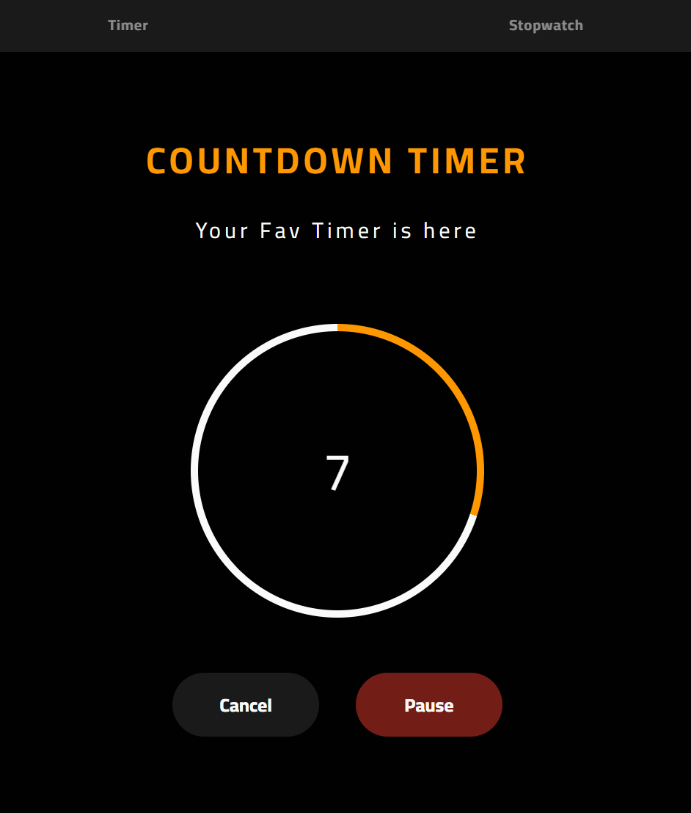
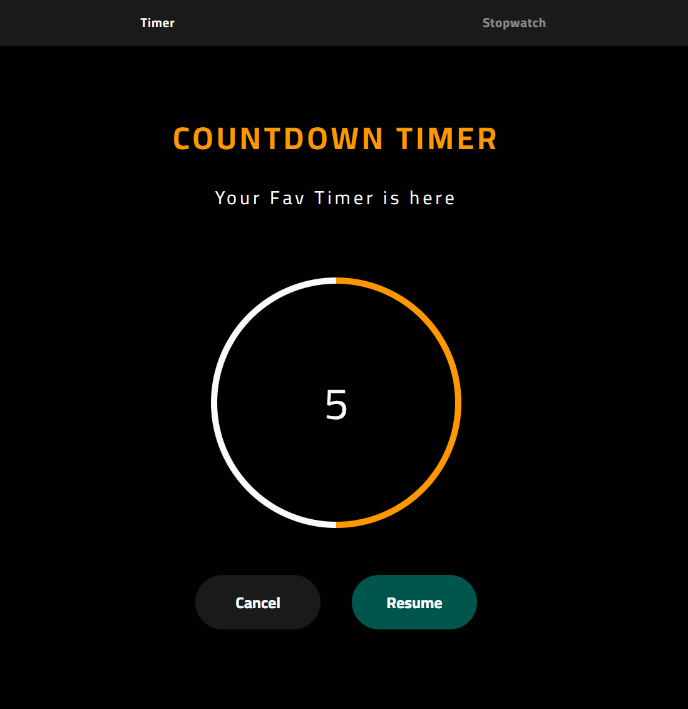
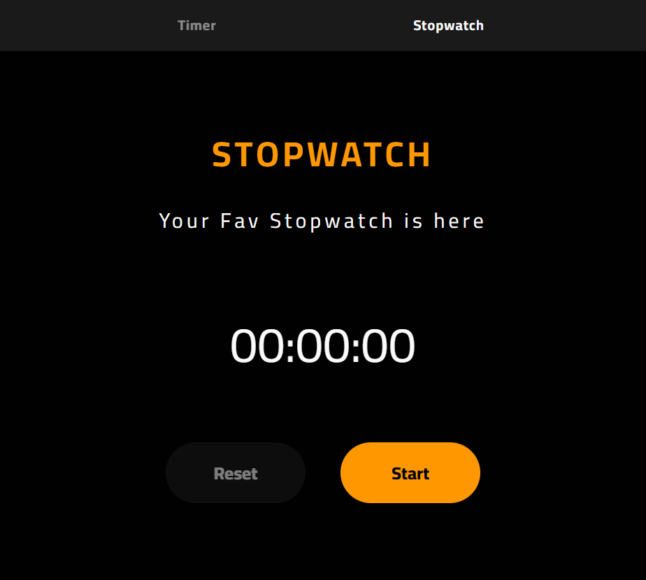

# Timer and Stopwatch

## Overview

This repository hosts the source code for a simple and user-friendly Timer and Stopwatch web application. Whether you need to time an activity or use a stopwatch to measure elapsed time, this application has you covered.

## Features

- **Timer**: Set a specific countdown time and start the timer.
- **Stopwatch**: Measure elapsed time with precision.
- **User-Friendly Interface**: Intuitive design for easy navigation.
- **Customization**: Adjust settings to suit your needs.
- **Responsive Design**: Works seamlessly on various devices.

## Demo

Check out the live demo of the Timer and Stopwatch application [here](https://ahmed-adel-morsi.github.io/Timer-and-Stopwatch/).

## Installation

No installation is required for this web-based application. Simply visit the provided link in your web browser.

## Usage

1. Open the application in your web browser.
2. Choose between the Timer and Stopwatch modes.
3. Configure the settings as needed.
4. Start the Timer or Stopwatch.

## Screenshots

### Countdown Timer

### Stopwatch

## Project Structure

The project follows a specific structure:

- `docs`: Documentation and images.
- `src`: Source code for the Timer and Stopwatch application.

## Contact

For questions or feedback, please contact the project maintainer:

- **Name**: Ahmed Adel Morsi
- **Email**: ahmedadel0239@gmail.com
